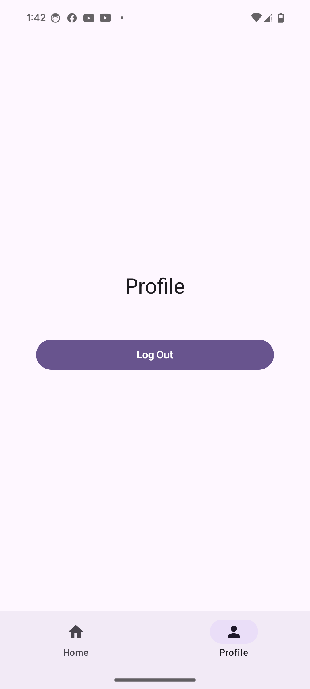

# Note-App-JWT

A modern Note-taking Android application built with Kotlin, Jetpack Compose, and Clean Architecture. 
The app features user authentication using JWT (JSON Web Tokens), dependency injection with Koin, and follows a hybrid Clean Architecture approach.

## Table of Contents

* [Features](#features)
* [Tech Stack](#tech-stack)
* [Architecture](#architecture)
* [Screenshots](#screenshots)

## Features

* User Registration & Login with JWT-based authentication
* Create, Read, Update, and Delete (CRUD) notes
* Jetpack Compose UI for a modern and declarative design
* Dependency Injection with Koin
* Hybrid Clean Architecture: clear separation of Layers (Presentation, Domain, Data)

## Tech Stack

* **Language:** Kotlin
* **UI:** Jetpack Compose
* **Dependency Injection:** Koin
* **Architecture:** Clean Architecture (Hybrid Strategy)
* **Networking:** Retrofit & OkHttp
* **Serialization:** Kotlinx Serialization
* **Authentication:** JWT
* **Build System:** Gradle (Kotlin DSL)

## Architecture

The project follows a Clean Architecture structure with three main modules/layers:

1. **Presentation:**

    * `Compose` UI Components
    * ViewModels (State management)
2. **Domain:**

    * Use Cases (business logic)
    * models & Interfaces
3. **Data:**

    * Repositories & Data Sources
    * Remote (API)

Dependency Injection is handled with Koin for each layer, providing an easy-to-follow DI graph.

## Screenshots

<!-- Add your screenshots in the `img/` folder and update the filenames below -->

  
  
  
  
  

